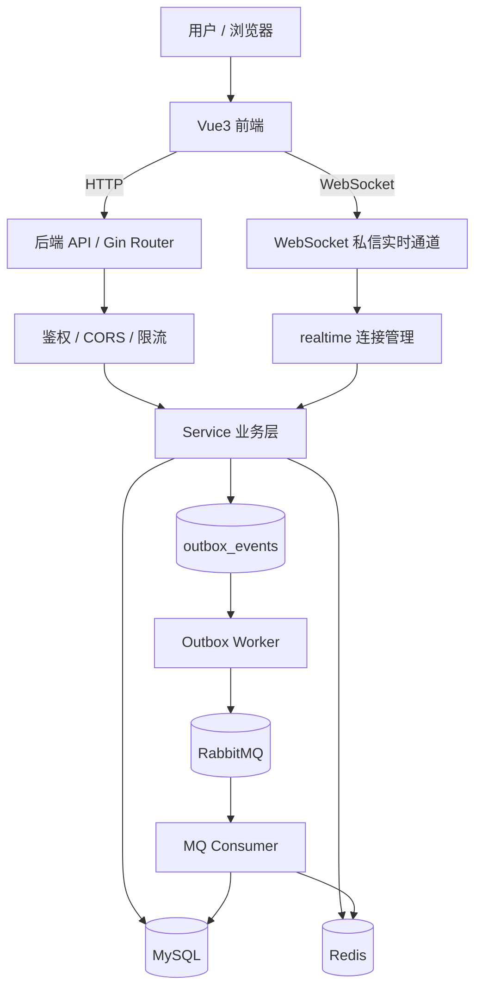
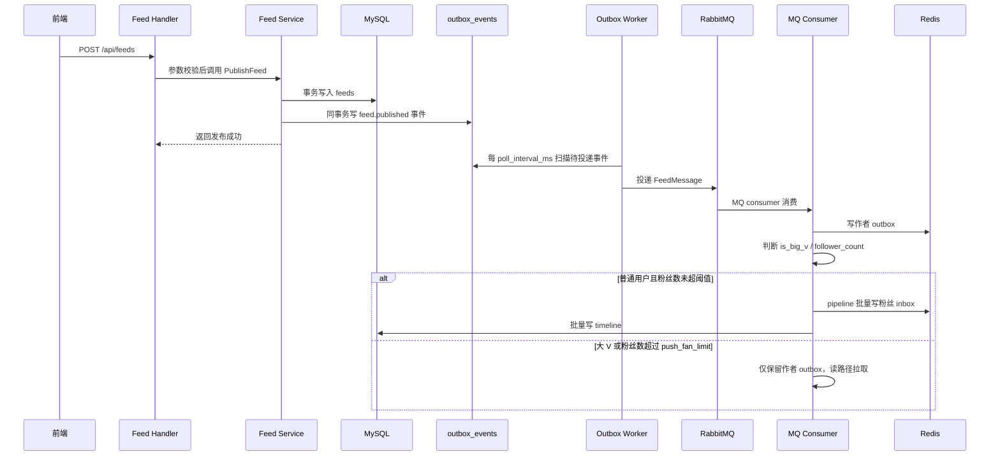
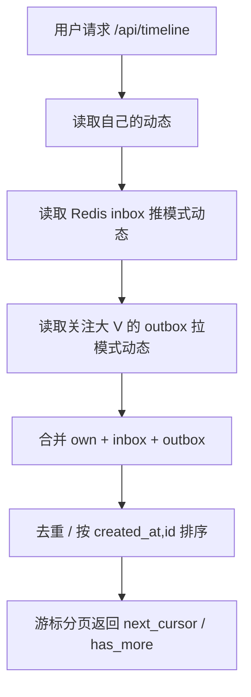
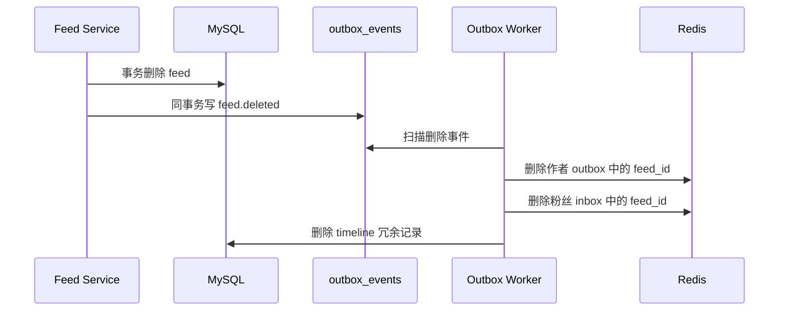
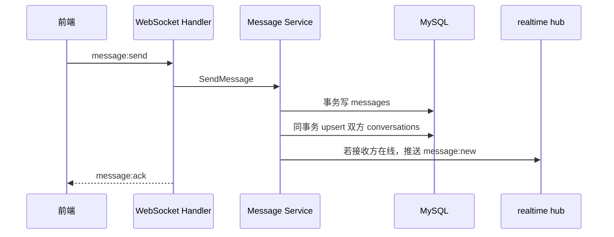
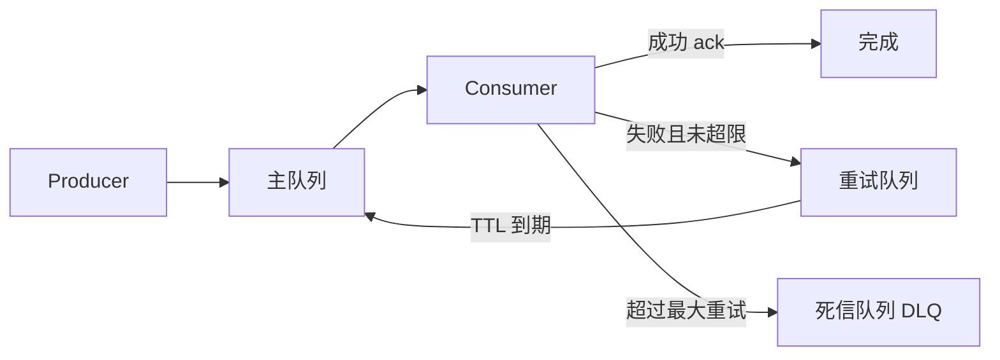

# FeedLink 社交系统（推拉混合 Feed + 私信 + 通知中心）

FeedLink 是一个基于 Go + Vue 的社交系统，核心目标是实现接近微博/朋友圈的信息流、关注关系、互动通知和私信能力。当前版本已经从简单 CRUD 演进为带有缓存、限流、可靠异步和实时通信的工程化实现。

## 当前已实现能力

- 用户体系：注册、登录、JWT 鉴权、资料修改、用户搜索、访问记录。
- 关注关系：关注/取关、粉丝列表、关注列表、Redis Set 缓存。
- Feed 动态：发布、删除、转发、详情、搜索、点赞、评论。
- 时间线：推拉混合，普通用户写扩散，大 V 读扩散，游标分页。
- 可靠异步：Outbox 事件表 + 后台 worker + RabbitMQ 分发。
- 私信系统：WebSocket 实时消息 + HTTP 会话/历史兜底接口 + conversations 会话表。
- 通知中心：点赞、评论、关注通知，分页与一键已读。
- Redis 能力：详情缓存、用户缓存、布隆过滤器、分布式锁、Lua 原子令牌桶限流。
- MQ 能力：主队列、重试队列、死信队列、幂等、熔断、降级。
- 运维观测：MQ 指标、缓存指标。

---

## 系统架构图



---

## Feed 发布与分发链路

当前 Feed 发布采用 **Outbox + RabbitMQ + 推拉混合**。



### 为什么使用 Outbox

发布 Feed 时，Feed 主表和分发事件需要保持一致。如果直接在写库后投递 MQ，服务可能在“写库成功、投递 MQ 前”宕机，导致动态存在但永远不会分发。当前实现将 `feeds` 和 `outbox_events` 放在同一个 DB 事务中，后台 worker 再可靠投递。

### Outbox 配置

`backend/config.yaml`：

```yaml
outbox:
  batch_size: 50
  poll_interval_ms: 2000
  max_retries: 10
  max_backoff_ms: 300000
```

含义：

- `batch_size`：每次最多扫描多少条事件。
- `poll_interval_ms`：后台 worker 轮询间隔，当前默认 2 秒。
- `max_retries`：最大重试次数，超过后进入 `dead` 状态。
- `max_backoff_ms`：指数退避最大间隔。

Outbox 事件状态：

- `pending`：待处理。
- `failed`：处理失败，等待下次重试。
- `sent`：处理成功。
- `dead`：超过最大重试次数，需要人工排查或重放。

---

## 时间线推拉混合



策略：

- 普通用户：发布后写扩散到粉丝 `inbox:{user_id}`。
- 大 V：只写作者 `outbox:{author_id}`，粉丝读取时间线时再拉取。
- 双保险：MQ consumer 会先看 `is_big_v`，并额外根据 `follower_count > push_fan_limit` 避免写爆。

---

## 删除 Feed 的可靠清理

删除动态时不再直接起裸 goroutine 清理，而是写入 `feed.deleted` Outbox 事件。



这样可以避免服务进程退出导致清理任务丢失，失败时也会进入 Outbox 重试。

---

## 私信系统

当前私信由三部分组成：

1. `messages`：保存每条私信记录。
2. `conversations`：每个用户维度的会话聚合表，用于快速展示联系人和未读数。
3. WebSocket + HTTP：WebSocket 负责实时收发，HTTP 负责会话列表与历史消息兜底读取。

### 私信发送流程



### 会话与历史读取

WebSocket 事件：

- `message:conversations`
- `message:history`
- `message:send`
- `message:new`
- `message:ack`
- `message:error`

HTTP 兜底接口：

- `GET /api/messages/conversations`
- `GET /api/messages/history/:target_id`

这样即使 WebSocket 暂时未连接，联系人列表和历史聊天记录仍然可以加载。只有实时发送仍要求 WebSocket 连接正常。

### 未读数

- 接收方收到新消息时，接收方对应的 `conversations.unread_count + 1`。
- 打开会话历史时，后端标记消息已读，并将当前用户该会话的 `unread_count` 清零。

---

## Redis 与限流

### 缓存

- Feed 详情缓存。
- 用户资料缓存。
- 关注/粉丝 Redis Set。
- inbox/outbox Redis ZSet。
- 布隆过滤器防缓存穿透。
- 写后主动失效缓存。
- TTL 随机抖动防缓存雪崩。
- 分布式锁降低热点回源并发。

### 令牌桶限流

当前令牌桶基于 Redis Lua 脚本实现，保证并发下扣减令牌的原子性。

限流维度：

- IP：登录、注册。
- 用户：发布、转发、私信。
- Feed：点赞、评论等热点资源操作。

配置位置：`backend/config.yaml` 的 `rate_limit` 与 `ws`。

---

## MQ 可靠性

RabbitMQ 拓扑：



已实现能力：

- 主队列、重试队列、死信队列。
- 消费失败延迟重试。
- Redis `SETNX + TTL` 消费幂等。
- MQ 发布失败熔断。
- 熔断时降级为仅写作者 outbox。
- 运维接口查看 MQ 指标。

---

## API 概览

### Auth

- `POST /api/auth/register`
- `POST /api/auth/login`

### User

- `GET /api/users/me`
- `PUT /api/users/me`
- `GET /api/users/me/visits`
- `GET /api/users/search`
- `GET /api/users/:id`

### Follow

- `POST /api/follow/:id`
- `DELETE /api/follow/:id`
- `GET /api/users/:id/followers`
- `GET /api/users/:id/following`

### Feed / Timeline

- `POST /api/feeds`
- `POST /api/feeds/repost`
- `DELETE /api/feeds/:id`
- `GET /api/feeds/:id`
- `GET /api/feeds/search`
- `GET /api/users/:id/feeds`
- `GET /api/timeline?cursor=&page_size=20`

### Like / Comment

- `POST /api/feeds/:id/like`
- `DELETE /api/feeds/:id/like`
- `GET /api/feeds/:id/likes`
- `POST /api/feeds/:id/comments`
- `GET /api/feeds/:id/comments`
- `DELETE /api/feeds/:id/comments/:comment_id`

### Message / WS

- `GET /api/ws/messages?token=xxx`
- `GET /api/messages/conversations`
- `GET /api/messages/history/:target_id`

### Notification

- `GET /api/notifications`
- `POST /api/notifications/read-all`

### Ops

- `GET /api/ops/mq/metrics`
- `GET /api/ops/cache/metrics`

---

## 项目结构

```text
feedlink/
├─ backend/
│  ├─ cache/          # Redis 缓存、布隆过滤器、分布式锁
│  ├─ config/         # Viper 配置加载
│  ├─ handlers/       # HTTP / WebSocket 入口
│  ├─ middleware/     # 鉴权、CORS、限流
│  ├─ models/         # GORM 模型
│  ├─ mq/             # RabbitMQ 发布、消费、重试、DLQ
│  ├─ realtime/       # WebSocket 连接管理
│  ├─ repository/     # 数据访问层
│  ├─ router/         # 路由注册
│  ├─ services/       # 核心业务逻辑、Outbox worker
│  ├─ utils/          # JWT、响应工具
│  ├─ config.yaml
│  └─ main.go
├─ frontend/
│  ├─ src/api/        # Axios 与 WebSocket API 封装
│  ├─ src/views/      # 页面
│  ├─ src/router/     # 前端路由
│  ├─ src/stores/     # Pinia
│  └─ vite.config.js
├─ docker-compose.yml
└─ README.md
```

---

## 本地运行

### 1. 启动依赖

```bash
docker compose up -d
```

默认会启动：

- MySQL：`localhost:3307`
- Redis：`localhost:6379`
- RabbitMQ：`localhost:5672`
- RabbitMQ 管理台：`http://localhost:15672`

### 2. 启动后端

```bash
cd backend
go mod tidy
go run main.go
```

默认地址：`http://localhost:8080`

### 3. 启动前端

```bash
cd frontend
npm install
npm run dev
```

当前 Vite 默认端口：`http://localhost:3000`

---

## 配置说明

核心配置文件：`backend/config.yaml`

重点配置：

- `server.auto_migrate`：是否启动时自动迁移表结构，开发环境可开，生产建议关闭。
- `cors.allow_origins`：允许的前端 Origin；debug 模式下本机端口会放行。
- `feed.big_v_threshold`：大 V 判断阈值。
- `feed.push_fan_limit`：普通用户写扩散粉丝数上限。
- `outbox.*`：Outbox worker 扫描、重试和退避配置。
- `rabbitmq.*`：队列、重试队列、死信队列、幂等 TTL。
- `rate_limit.*`：HTTP 接口令牌桶限流。
- `ws.send_message`：WebSocket 发送消息限流。

---

## 数据表补充说明

除常规用户、关注、动态、点赞、评论、通知、消息表外，当前版本重点新增：

- `outbox_events`：可靠事件表，用于 Feed 发布分发和删除清理。
- `conversations`：私信会话聚合表，用于联系人列表和未读数。

如果关闭 `server.auto_migrate`，需要手动维护 migration。

---

## 后续可继续增强

- 为 `dead` Outbox 事件提供后台查看与手动重放接口。
- 为历史私信提供一次性 conversations 回填脚本。
- MQ consumer 支持更完整的 context 优雅退出。
- 搜索升级到 MySQL FULLTEXT / Elasticsearch。
- 上传存储抽象为本地、OSS、S3 多实现。
- 前端路由拆包，优化 Vite chunk 体积。

---

## License

MIT
