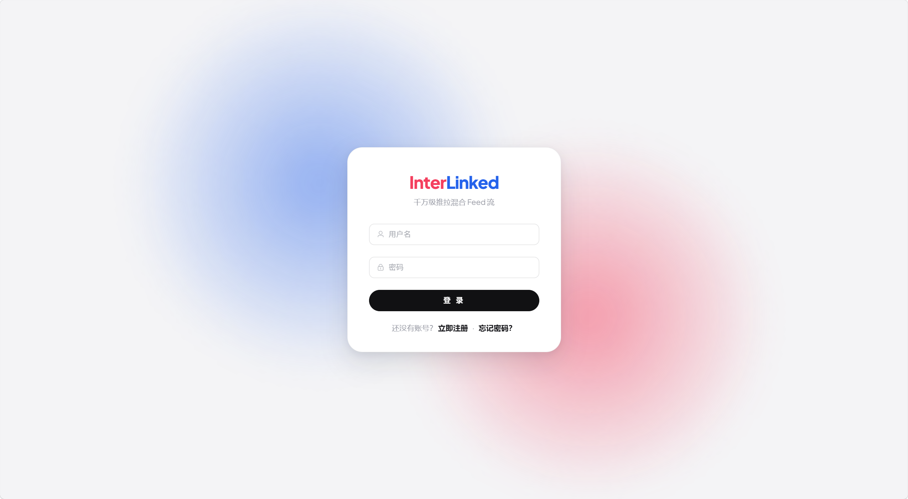
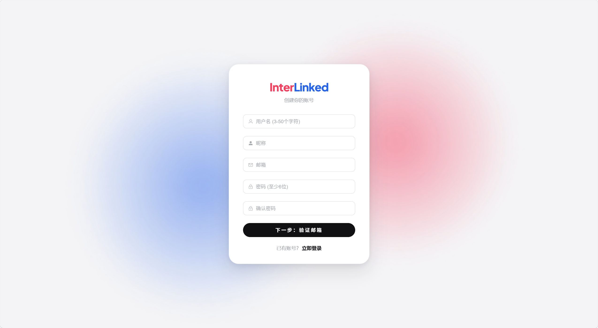
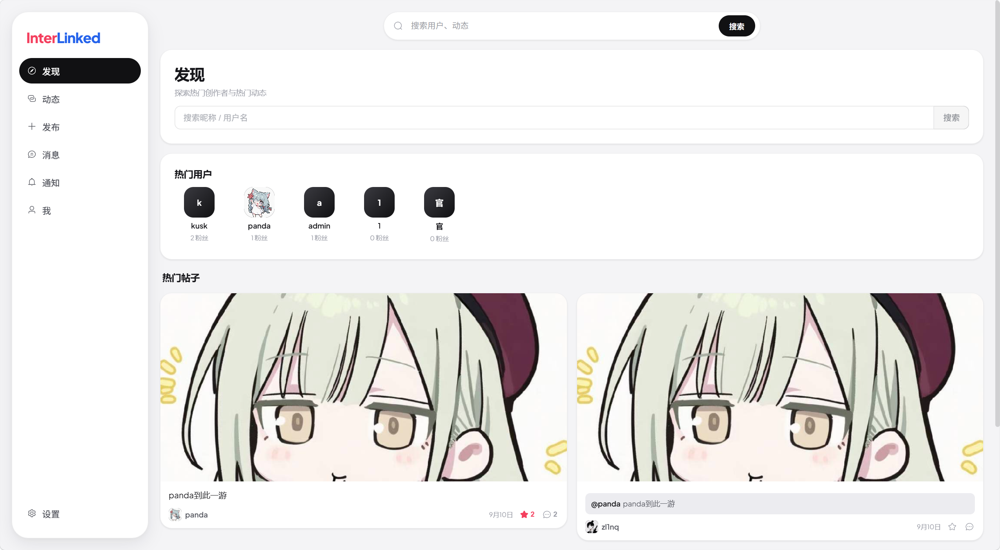
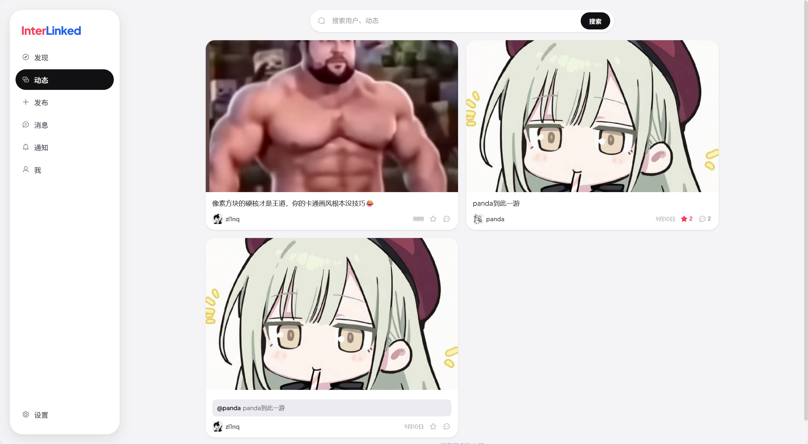
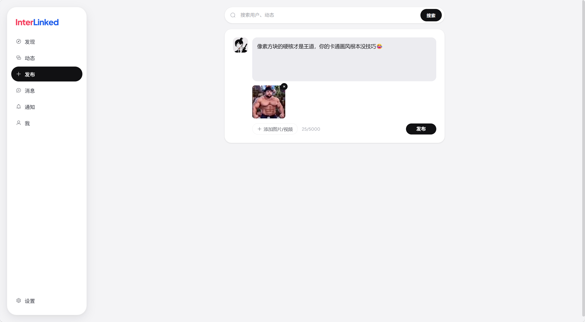
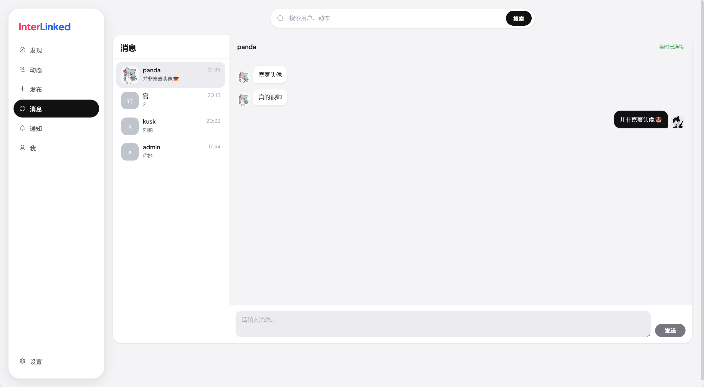
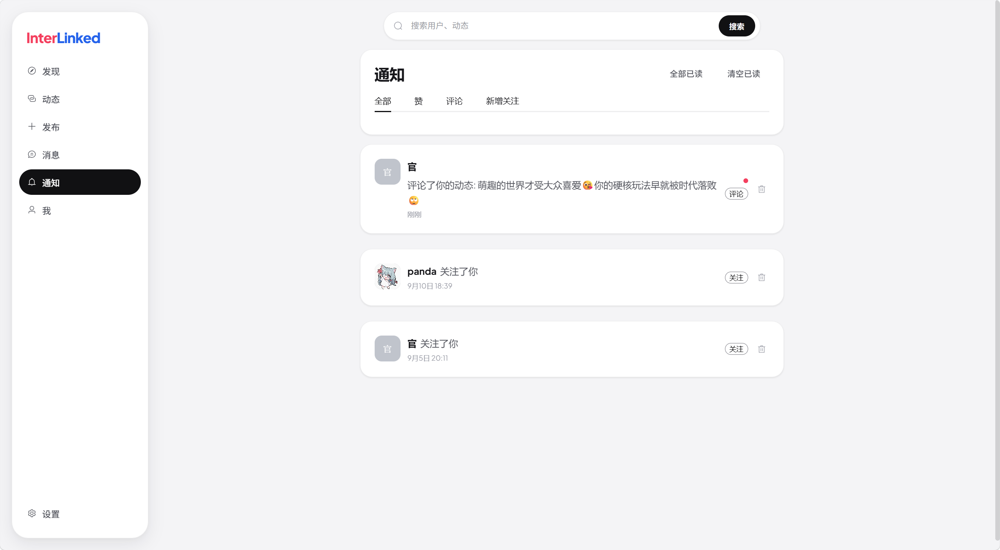
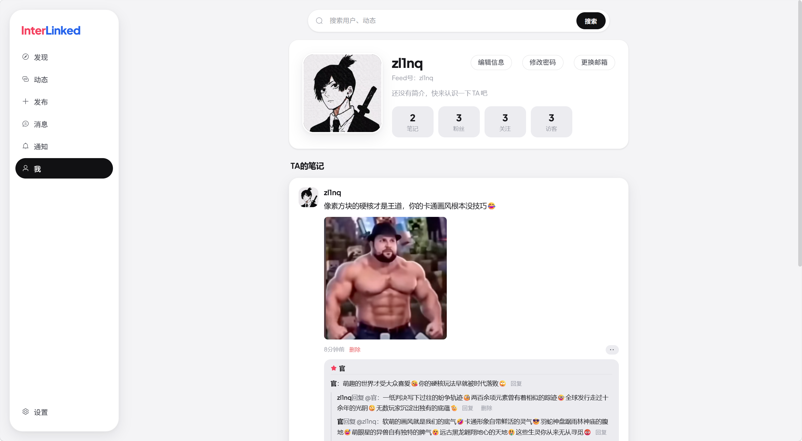
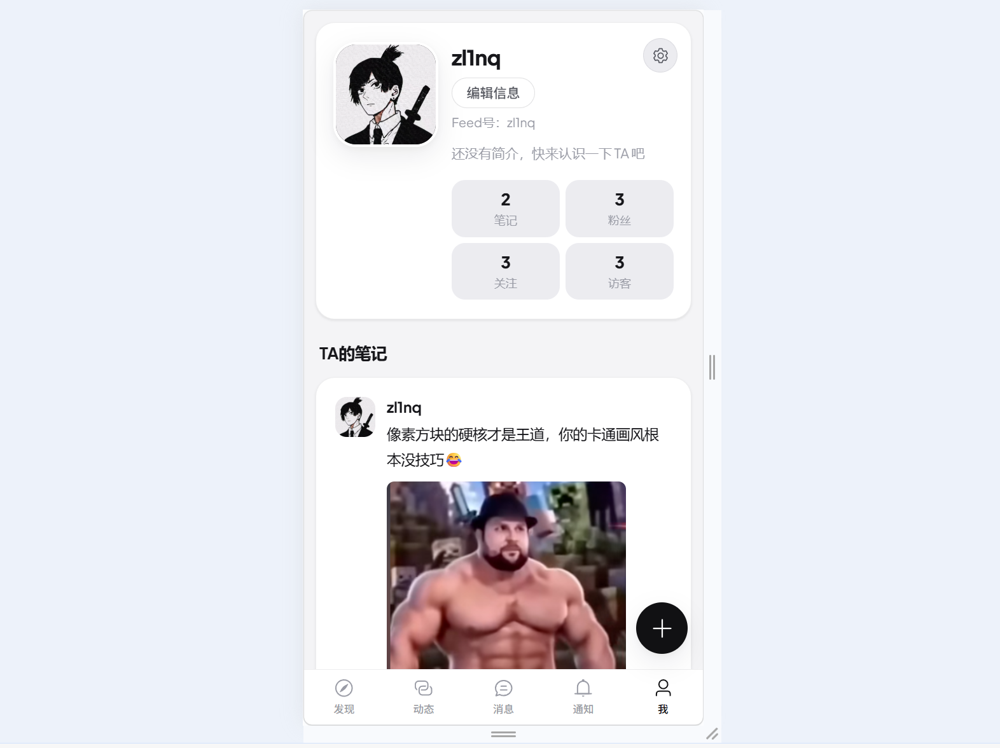

## interlinked 项目演示

### 主要页面展示

- 登录

- 注册(支持邮箱验证)

- 发现页

- 动态页

- 发布动态: 支持发布文本、图片、视频等格式 (文件大小限制可以在`config.yaml`中配置)

- 动态详情: 支持点赞、转发、评论以及评论回复等等

- 消息页

- 通知: 支持查看和管理系统通知

- 用户页: 修改个人信息、查看和管理关注用户、查看和管理发布的内容等

### 页面适配不同设备的屏幕尺寸

